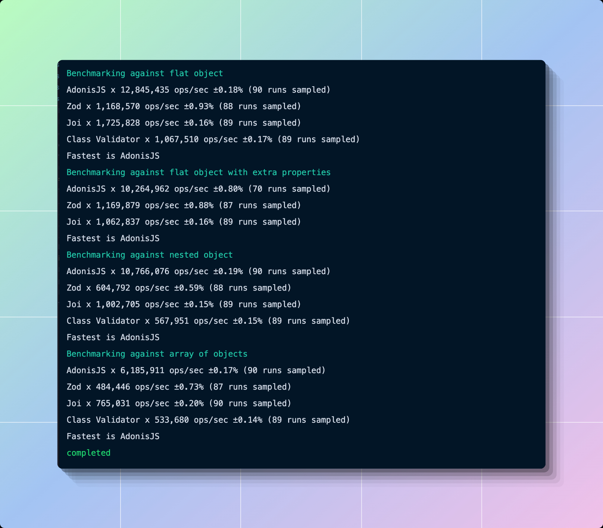

# @adonisjs/validator

 

  

[![gh-workflow-image]][gh-workflow-url] [![npm-image]][npm-url] ![][typescript-image] [![license-image]][license-url] [![synk-image]][synk-url]

## Introduction
AdonisJS validator is a type-safe schema validation library to validate form requests. It is one of the **fastest validation** library in the Node.js ecosystem.

## Official Documentation
The documentation is available on the [AdonisJS website](https://docs.adonisjs.com/guides/validator/introduction)

## Contributing
One of the primary goals of AdonisJS is to have a vibrant community of users and contributors who believes in the principles of the framework.

We encourage you to read the [contribution guide](https://github.com/adonisjs/.github/blob/main/docs/CONTRIBUTING.md) before contributing to the framework.

## Code of Conduct
In order to ensure that the AdonisJS community is welcoming to all, please review and abide by the [Code of Conduct](https://github.com/adonisjs/.github/blob/main/docs/CODE_OF_CONDUCT.md).

## License
AdonisJS validator is open-sourced software licensed under the [MIT license](LICENSE.md).

  <h3>
    <a href="https://adonisjs.com">
      Website
    </a>
     | 
    <a href="https://docs.adonisjs.com/guides/validator/introduction">
      Guides
    </a>
     | 
    <a href="CONTRIBUTING.md">
      Contributing
    </a>
  </h3>

	Built with ❤︎ by <a href="https://twitter.com/AmanVirk1">Harminder Virk</a>

[gh-workflow-image]: https://img.shields.io/github/actions/workflow/status/adonisjs/validator/test.yml?style=for-the-badge
[gh-workflow-url]: https://github.com/adonisjs/validator/actions/workflows/test.yml "Github action"

[typescript-image]: https://img.shields.io/badge/Typescript-294E80.svg?style=for-the-badge&logo=typescript
[typescript-url]:  "typescript"

[npm-image]: https://img.shields.io/npm/v/@adonisjs/validator/alpha.svg?style=for-the-badge&logo=npm
[npm-url]: https://npmjs.org/package/@adonisjs/validator/v/alpha "npm"

[license-image]: https://img.shields.io/npm/l/@adonisjs/validator?color=blueviolet&style=for-the-badge
[license-url]: LICENSE.md "license"

[synk-image]: https://img.shields.io/snyk/vulnerabilities/github/adonisjs/validator?label=Synk%20Vulnerabilities&style=for-the-badge
[synk-url]: https://snyk.io/test/github/adonisjs/validator?targetFile=package.json "synk"
