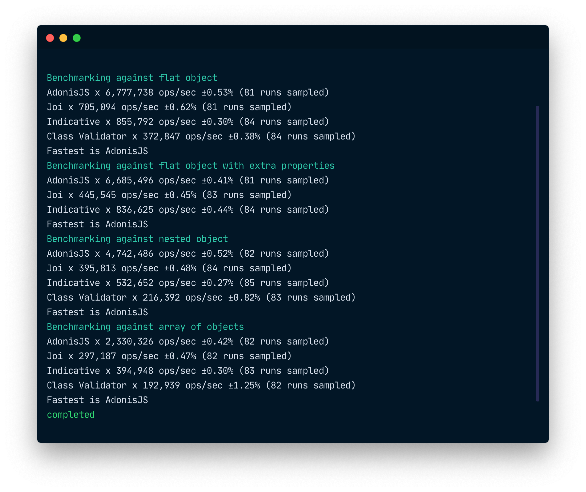

  

 

  <h3>AdonisJS Validator</h3>
  
A fluent and super fast validation engine for AdonisJS. In performance AdonisJS validator out performs many of its competitors.

 

[![circleci-image]][circleci-url] [![npm-image]][npm-url] ![][typescript-image] [![license-image]][license-url]

  

  <h3>
    <a href="https://adonisjs.com">
      Website
    </a>
     | 
    <a href="https://adonisjs.com/docs">
      Guides
    </a>
     | 
    <a href="CONTRIBUTING.md">
      Contributing
    </a>
  </h3>

  Built with ❤︎ by <a href="https://github.com/thetutlage">Harminder Virk</a>

[circleci-image]: https://img.shields.io/circleci/project/github/adonisjs/validator/master.svg?style=for-the-badge&logo=circleci
[circleci-url]: https://circleci.com/gh/adonisjs/validator "circleci"

[typescript-image]: https://img.shields.io/badge/Typescript-294E80.svg?style=for-the-badge&logo=typescript
[typescript-url]:  "typescript"

[npm-image]: https://img.shields.io/npm/v/@adonisjs/validator/alpha.svg?style=for-the-badge&logo=npm
[npm-url]: https://npmjs.org/package/@adonisjs/validator/v/alpha "npm"

[license-image]: https://img.shields.io/npm/l/@adonisjs/validator?color=blueviolet&style=for-the-badge
[license-url]: LICENSE.md "license"
